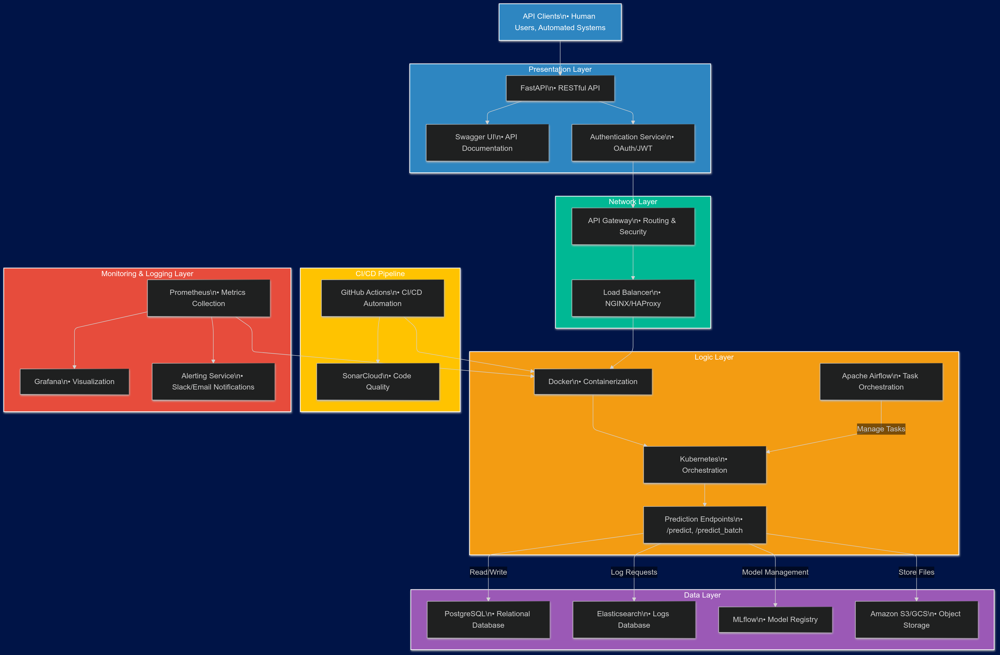

# AB InBev MLOps Challenge - Cristhian Guerrero

This repository contains the implementation of the AB InBev MLOps Challenge by Cristhian Guerrero. The project involves deploying a pre-trained machine learning model as a RESTful API using FastAPI. The API supports both single and batch predictions and stores each prediction in a PostgreSQL database. The application is containerized using Docker and orchestrated with Docker Compose. Continuous integration and code quality checks are performed using GitHub Actions and SonarCloud.


## Table of Contents

- [Prerequisites](#prerequisites)
- [Installation](#installation)
- [Usage](#usage)
- [API Documentation](#api-documentation)
- [Architecture](#architecture)
- [Testing](#testing)
- [Continuous Integration](#continuous-integration)
- [Contributing](#contributing)
- [License](#license)
- [Contact Information](#contact-information)


## Prerequisites

Before you begin, ensure you have met the following requirements:

- **Docker**: Install Docker from the [official website](https://www.docker.com/get-started).
- **Docker Compose**: Install Docker Compose by following the instructions [here](https://docs.docker.com/compose/install/).
- **Git**: You need Git installed to clone the repository. Download it [here](https://git-scm.com/downloads).
- **Python 3.9+**: If you plan to run the application locally without Docker, ensure you have Python installed from [python.org](https://www.python.org/downloads/).

Optional but recommended:

- **Postman** or **cURL**: For testing API endpoints.


## Installation

### Clone the Repository

First, clone the repository to your local machine:

```bash
git clone https://github.com/Cristhian-Guerrero/ABIChallenge_Cristhian-Guerrero.git
cd ABIChallenge_Cristhian-Guerrero
```

### Build and Start the Docker Containers

To build the Docker image and start the services, use Docker Compose:

```bash
docker-compose up --build
```
This command will build the Docker images and start the application and database services.

Usage
Once the application is running, you can access the API at http://localhost:8000.

### Single Prediction

* Endpoint: /predict

* Method: POST

* Request Body:

```bash
[
  {
    "Frequency": 5,
    "MonetaryValue": 1000.0
  }
]
```

#### Response:

```bash
{
  "clusters": [0]

}
```

### Batch Prediction

* Endpoint: /predict
* Method: POST
* Request Body:

```bash
[
  {
    "Frequency": 5,
    "MonetaryValue": 1000.0
  },
  {
    "Frequency": 10,
    "MonetaryValue": 500.0
  },
  {
    "Frequency": 2,
    "MonetaryValue": 1500.0
  }

```
* Response


```bash
{
  "clusters": [0, 1, 0]
}

```

## API Documentation
The API documentation is available via Swagger UI:

* Open your browser and navigate to http://localhost:8000/docs to view the interactive API documentation.

## Architecture




The application architecture consists of the following components:

* FastAPI Application: Serves the machine learning model through RESTful API endpoints.
* PostgreSQL Database: Stores each prediction made by the model.
* Docker and Docker Compose: Containerization and orchestration of application and database services.
* CI/CD Pipeline: Automated testing and code quality checks via GitHub Actions and SonarCloud.

## Testing
To run the tests, execute the following command:

```bash
pytest tests/

```
The tests cover:

* API endpoint responses.
* Model prediction outputs.
* Database storage verification.

### Continuous Integration
The project uses GitHub Actions for continuous integration:

* SonarCloud Integration: Ensures code quality and security standards are met.
* Automated Testing: Runs the test suite on each push to the repository.

### Contributing
Contributions are welcome! Please follow these steps:

Fork the repository.
Create a new branch (git checkout -b feature/your-feature).
Commit your changes (git commit -m 'Add some feature').
Push to the branch (git push origin feature/your-feature).
Open a Pull Request.


Contact Information
Author: Cristhian Guerrero
Email: cristhian3815@gmail.com
LinkedIn: [our LinkedIn Profile](https://www.linkedin.com/in/cristhian-guerrero/)

